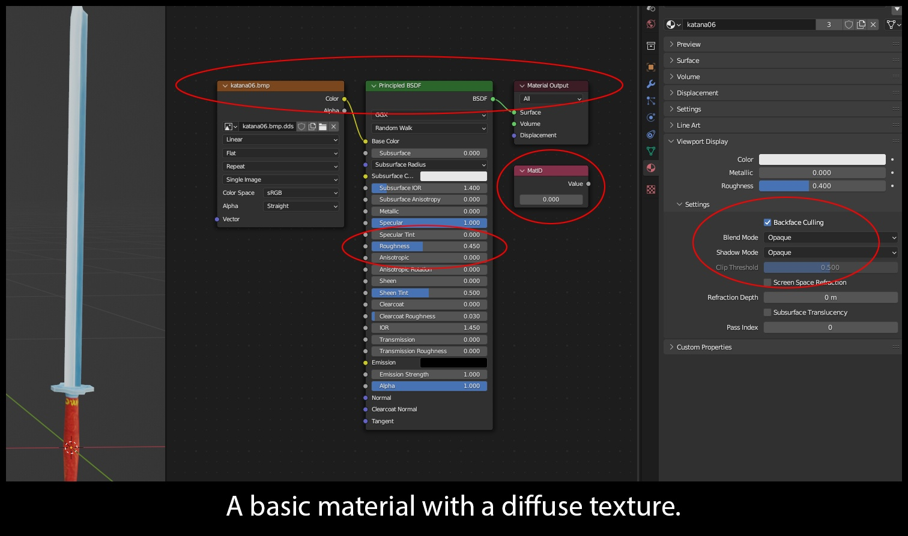
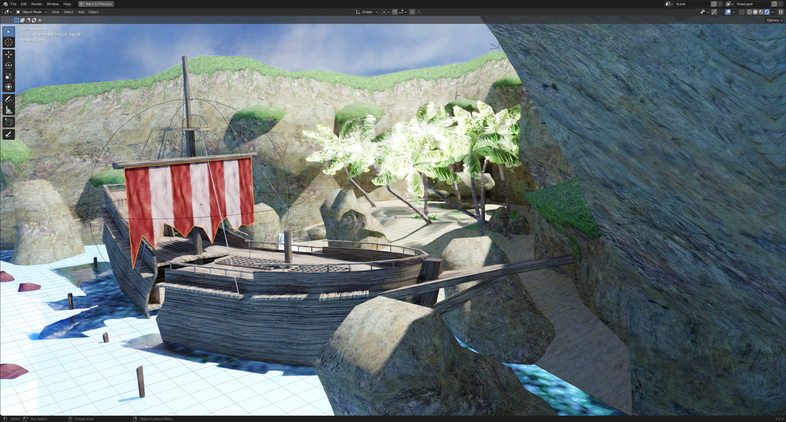

# ***io_scene_gzrs2***

GunZ: The Duel RealSpace2/3 content importer for Blender 3.6.2 and up.  
Intended for users wishing to visualize and modify GunZ content or prepare the data for a modern game engine.

Please report bugs and unimplemented features to: ***Krunk#6051***

RaGEZONE thread: ***https://forum.ragezone.com/f496/io_scene_gzrs2-blender-3-1-map-1204327/***

[***DOWNLOAD v0.9.2***](https://github.com/Krunklehorn/io-scene-gzrs2/releases/download/v0.9.2/io_scene_gzrs2_v0.9.2.zip)

# Latest Update

* NEW: .elu version 0x0 and 0x11 import support
* NEW: .elu export support
* Elu meshes now support multiple material slots
* Elu meshes now include cloth physics data as color attributes
* Elu materials now include...
	* empty texture nodes for missing textures
	* value nodes for material ID, sub-material ID and sub-material count
	* RGB nodes for ambient, diffuse and specular colors
* Elu logging now includes extra min/max information for some fields
* Users are now warned if an .rs, .elu, .col or .lm file has bytes remaining after a successful read
* Naming conventions are a bit tidier

# Current Import Features

* supported filetypes: .rs, .elu, .col, .lm, .scene.xml, .prop.xml, .cl2
* displays world geometry, occlusion planes and collision data using mesh objects
* displays BSP bounding boxes, sounds, spawns, powerups and other dummies using empties
* approximates fog using a volume scatter or volume absorption shader
* groups lights with similar properties, re-interprets the data to be useful in Blender
* displays lightmaps using a linked node group for quick toggling
* creates a driver object for quickly tuning lights and fog
* notifies the user of..
  * missing textures and empty texture paths during import
	* invalid texture paths during export (see below)
  * out-of-bounds and unused material slots
  * unimplemented xml tags

# Current Export Features

### Elus

* GunZ 1 version 0x5007
* supports both static and skinned meshes
* automatically triangulates quads

<!-- -->

* exports smooth normals if custom split normals are included and auto-smooth is enabled
* exports bone weight data from vertex groups
* exports UV data from UV channel 0
* exports cloth physics data from color attribute channel 0

<!-- -->

* requires unique names for all bones across all connected armatures
* requires that vertex group names correspond to valid bones in a modifier-linked (not parented!) armature object
* requires valid materials in each slot, if present

##### Required Material Nodes

| Type | Label (right click -> rename) | Socket Configuration |
| :---: | :---: | :---: |
| Material Output || BSDF -> Surface |
| Principled BSDF || BSDF -> Surface |
| Value | matID ||

##### Optional Nodes

| Type | Default | Label (right click -> rename) | Details |
| :---: | :---: | :---: | :---: |
| Image Texture | N/A | If labeled, represents a path relative to GunZ.exe | If included, Color -> PBSDF Base Color is required |
| Value | 0 | subMatID | May be required for certain effects |
| Value | 0 | subMatCount | May be required for certain effects |
| RGB | 0.588, 0.588, 0.588 | ambient ||
| RGB | 0.588, 0.588, 0.588 | diffuse ||
| RGB | 0.9, 0.9, 0.9 | specular ||

##### Transparency Settings

| Style | Blend Mode | Details | Socket Configuration |
| :---: | :---: | :---: | :---: |
| Alpha Blending | Alpha Hashed || Image Texture Alpha -> PBSDF Alpha |
| Alpha Testing | Alpha Clip || Image Texture Alpha -> PBSDF Alpha |
| Additive | Alpha Blend || Image Texture Color -> PBSDF Emission |

##### Extra Controls

| Control | Details |
| :---: | :---: |
| Two-sided | Controlled by the Backface Culling checkbox |
| Specular Smoothness | Controlled by the the Principled BSDF Roughness value, lower is smoother |

##### Notes on texture paths, labels and valid data subdirectories...

In Blender, if an Image Texture node does not use a label, it will simply display the name of whatever image data block it is assigned to.

The path Blender uses to refer to an image on disk is not always relative to your .elu's export directory. It may also contain two filetype extensions, the latter of which should be omitted in the context of the RealSpace2 engine.

To work around this, the plugin will search the image path for a valid RealSpace2 data subdirectory so that the path written to the .elu is relative to GunZ.exe. It will also remove the second extension if multiple are present. (ex: tex.bmp.dds -> tex.bmp)

If you get this error during export...

    Unable to determine data path for texture in ELU material!

...this means the image path does not contain a valid RealSpace2 data subdirectory.
Valid data subdirectories are...

    'Interface', 'Maps', 'Model', 'Quest', 'Sfx', 'Shader', 'Sound' or 'System'

This check is not case sensitive.

You can override this check by labeling an Image Texture node, (right click -> rename) allowing explicit control over what path is written.

During import, texture paths without a directory, valid or not, apply this override automatically to preserve their behavior when loaded by RealSpace2.

### Lightmaps

* overwrite only
* supports image data as well as UVs
  * requires a GunZ 1 .rs file for the same map in the same directory
  * UV export requires an active mesh object with valid UVs in channel 3
* includes experimental "version 4" for bugfixes and DXT1 support (thanks to DeffJay)
  * version 4 lightmaps take less space and load faster, resolutions up to 8k are now viable
  * they require client changes and do not work with vanilla GunZ
  * contact Krunk#6051 for information on how to implement this

# Planned Features

* GunZ 1.5 elu versions: 0x0, 0x11 and 0x5001, 0x5002 & 0x5003
* GunZ 2 retail elu versions: 0x5012, 0x5013 & 0x5014
* .ani support
* nav mesh support

# Known Issues

* quest maps and community maps have not been tested at all yet
* handful of GunZ 1 elus with improper bone weights (woman-parts_eola)
* GunZ 1 UV layer 2 comes out mangled (just import the lightmap and use layer 3 for now)
* GunZ 2 some objects are not oriented correctly (spotlights)
* GunZ 2 embedded scene hierarchies are not parsed yet (lighting_candlestick_y02, lighting_chandelier_g01, etc.)

# Special Thanks

[three-gunz](https://github.com/LostMyCode/three-gunz)  
[open-gunz](https://github.com/open-gunz/ogz-source)  
[rahulshekhawat](https://github.com/rahulshekhawat/blender-elu-ani-importer)  
[x1nixmzeng](https://github.com/x1nixmzeng/z3ResEx)  
[Nayr438](https://github.com/Nayr438)  
[DeffJay](https://github.com/Jetman823)  
